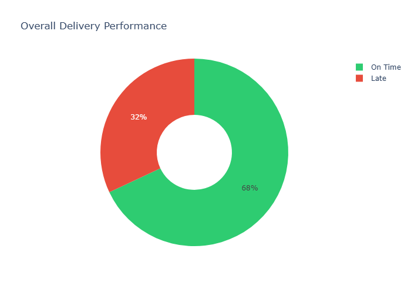
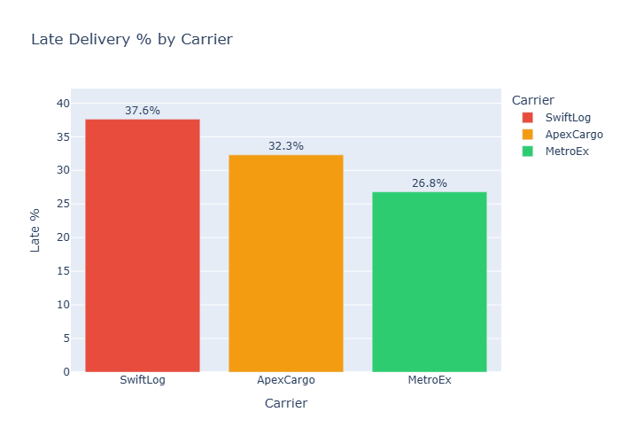
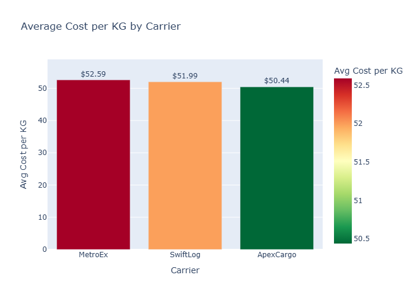

# 🚚 Logistics Performance Analysis
### Uncovering Why 32% of Deliveries Arrive Late


---

## 📌 Why I Built This

When I first looked at this logistics dataset,
I didn't just see rows and columns.
I saw a business with a problem
customers not receiving their orders on time,
and nobody knowing exactly why.

As someone building toward a data career,
I wanted to practice not just writing code,
but thinking like an analyst:
**What does the business actually need to know?**

That question drove every decision in this project.

---

## 🎯 The Business Problem

A logistics company manages shipments across
3 carriers — SwiftLog, ApexCargo, and MetroEx.

They had no visibility into:
- Which carrier was causing the most delays?
- Were they paying a fair price per KG shipped?
- Is their overall delivery performance
  acceptable by industry standards?

Decisions were being made without data.
This project changes that.

---

## 📂 Dataset Overview

| Detail | Value |
|--------|-------|
| Total Shipments | 500 |
| Columns | 15 |
| Carriers | 3 (SwiftLog, ApexCargo, MetroEx) |
| Transport Modes | Air, Ground, Rail |
| Date Range | 2026 |

---

## 🧹 Data Cleaning — What I Found & Fixed

When I first loaded the data I ran
`df.isnull().sum()` to check every column.

**What I discovered:**

| Column | Missing Values | Action Taken |
|--------|---------------|--------------|
| Processing Days | 500/500 | ❌ Deleted — completely empty |
| Cost per KG ($) | 500/500 | ✅ Calculated from existing data |
| On-Time Status | 500/500 | ✅ Calculated from existing data |

> The most important lesson here:
> Missing doesn't always mean useless.
> Two of these columns I was able to
> **calculate myself** using data I already had!

---

## ⚙️ Feature Engineering — What I Created

### 1. Cost per KG
```python
df['Cost per KG ($)'] = (
    df['Freight Cost ($)'] / df['Weight (KG)']
).round(2)
```

**Why I created this:**
Total freight cost alone is misleading.
A $20,000 shipment sounds expensive
but if it weighs 2000 KG, that's only $10/KG!
Cost per KG allows fair comparison
between shipments of all sizes.

### 2. On-Time Status
```python
df['On-Time Status'] = np.where(
    df['Actual Days'] <= df['Promised Days'],
    'On Time', 'Late'
)
```

**Why I created this:**
Numbers alone don't tell the story.
Converting days into On Time / Late
turns raw data into a business metric
that anyone can understand immediately.

---

## 📊 Key Findings

### Finding 1 — Overall Performance


340 shipments (68%) → On Time ✅
160 shipments (32%) → Late ❌


Industry standard is 80%+ on time.
This company is performing below average.
1 in 3 customers is receiving a late order.

---

### Finding 2 — Carrier Performance


| Carrier | Late | On Time | Total | Late % |
|---------|------|---------|-------|--------|
| SwiftLog | 59 | 98 | 157 | 37.6% 🔴 |
| ApexCargo | 53 | 111 | 164 | 32.3% 🟡 |
| MetroEx | 48 | 131 | 179 | 26.8% 🟢 |

The gap between SwiftLog and MetroEx
is 10.8 percentage points.
That's the difference between
a satisfied customer and a complaint.

---

### Finding 3 — Cost Efficiency


| Carrier | Avg Cost/KG | Reliability |
|---------|-------------|-------------|
| MetroEx | $52.59 | Best ✅ |
| SwiftLog | $51.99 | Worst ❌ |
| ApexCargo | $50.44 | Middle 🟡 |

SwiftLog charges almost the same as MetroEx
but delivers late 37.6% of the time.
That is poor value for money.

---

### Finding 4 — Weight Drives Cost More Than Carrier!

This was my most surprising finding: 
Small shipment (72 KG) → $119.61 per KG 😱
Bulk shipment (1847 KG) → $12.33 per KG ✅

A 10x difference in cost per KG
not because of the carrier,
but because of the shipment size!

Consolidating small shipments into
bulk orders could save far more money
than switching carriers ever would.

---

## 💼 Business Recommendations

### 1. SwiftLog — Immediate Action Required ⚠️
37.6% late rate is the highest of all carriers.
Nearly 4 in every 10 customers are affected.

**Recommendation:**
Negotiate stricter SLA terms or gradually
reduce shipment allocation to SwiftLog
until performance improves.

### 2. MetroEx — Increase Usage ✅
Most reliable carrier at 26.8% late.
Handles the most shipments (179) already.
Small cost premium justified by better
delivery performance.

**Recommendation:**
Prioritize MetroEx for time-sensitive
and high-value shipments.

### 3. ApexCargo — Strategic Positioning 🎯
Cheapest carrier ($50.44/KG) with
middle-ground reliability (32.3% late).

**Recommendation:**
Use ApexCargo for bulk, non-urgent
shipments where cost saving matters
more than speed.

### 4. Consolidate Small Shipments 💡
The biggest cost saving opportunity
is not about carriers at all.
it is about shipment size.

**Recommendation:**
Implement minimum weight thresholds.
Consolidate small orders before dispatching
to reduce cost per KG by up to 90%.

---

## 🛠️ Tools Used

| Tool | Purpose |
|------|---------|
| Python 3.13 | Core programming language |
| Pandas | Data loading, cleaning, analysis |
| NumPy | On-Time Status calculation |
| Plotly | Interactive visualizations |
| Matplotlib | Static dashboard export |
| Jupyter Notebook | Development environment |

---

## 📁 Project Files
📓 Day2_Logistics_Analysis1.ipynb
🖼️ chart1_delivery_status.png
🖼️ chart2_carrier_late.png
🖼️ chart3_cost_per_kg.png
📊 logistics_dashboard.png
📋 Logistics_Raw_Data_Practice_Set.xlsx


---

## 🌱 What I Learned

This project taught me that data cleaning
is not just removing bad data
sometimes missing columns are opportunities
to engineer something more meaningful.

I also learned that the most valuable insight
often is not in the obvious numbers.
Everyone can see 32% late
but finding that weight drives cost
more than carrier choice required
actually exploring the data with curiosity.

That is the kind of analysis
I want to keep building toward.

---

## 🔗 Connect With Me

- 💼 LinkedIn: https://www.linkedin.com/in/ghouser-jahan-b0000a415/
- 🐙 GitHub: github.com/Ghouser-99m
- 📧 Email: ghghouser@gmail.com
